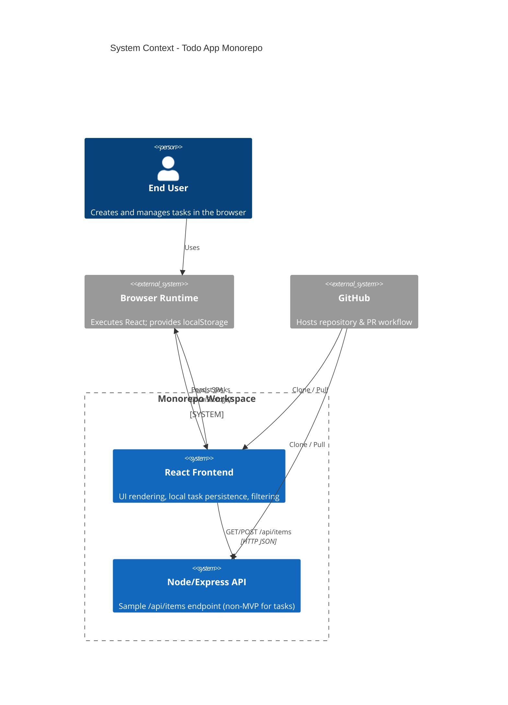
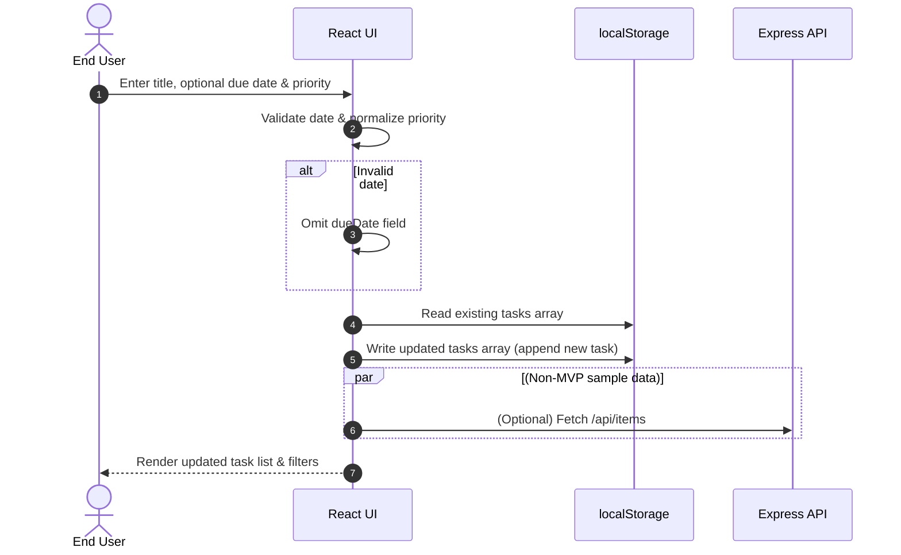

# Cloud / System Architecture Overview

This document provides a high-level system context for the Todo App monorepo. The current MVP architecture emphasizes a self-contained frontend that persists task data locally (browser `localStorage`) while a simple Node/Express backend delivers a sample items API that is *not* part of the MVP task data flow (kept for instructional/demo purposes).

## Key Points
- Frontend (React) handles all Todo task CRUD in-browser; no backend dependency for task persistence per MVP scope.
- Backend (Express) currently exposes `/api/items` for sample data only.
- GitHub hosts the monorepo (version control, pull requests, potential CI/CD later).
- The browser environment supplies `localStorage` used as the persistence layer.
- Future Post-MVP changes (e.g., moving persistence server-side) would introduce new relationships not shown here.

## System Context Diagram

## Future Considerations
- Introducing a backend persistence service would add: Frontend → Persistence API (CRUD Tasks) and Backend → Database components.
- Potential CI/CD pipeline (GitHub Actions) could be represented as an external system triggering builds/deployments.
- Authentication or multi-user support (currently out-of-scope) would add an Auth Provider external system.

## Sequence: Create Todo Flow

## Change Log
- v1 (2025-09-29): Initial context diagram created.
- v2 (2025-09-29): Added create todo sequence diagram.
